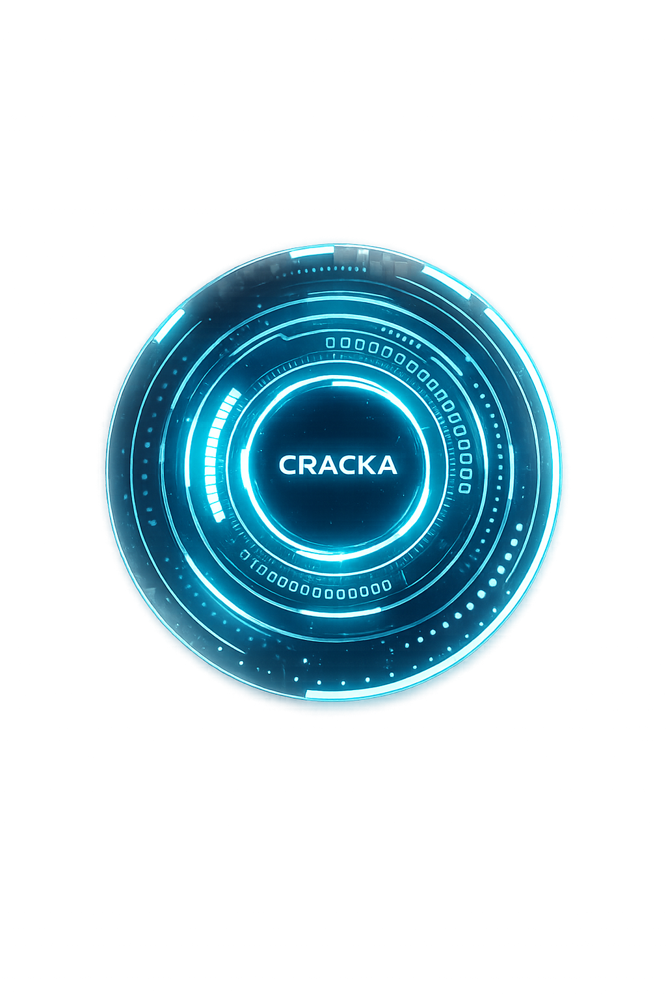

# Cracka — AI + Cybersecurity Assistant

<p align="center">
  
</p>

<p align="center">
  <b>Voice & GUI powered AI Assistant with built-in Cybersecurity Intelligence</b><br/>
  <i>Work in Progress — Actively Building</i>
</p>

<p align="center">
  
  
  
  
</p>

---

## What is Cracka?

**Cracka** is a personal AI assistant that combines the power of **Artificial Intelligence** and **Cybersecurity** into one unified system. It can be controlled via **Voice commands** or a **Graphical Interface (GUI)**, and is capable of automating tasks, understanding emotions, detecting threats, and learning over time.

> This project is actively under development. Features are being added and improved continuously.

---

## Features

### AI Intelligence
- Voice and GUI control
- Chat engine with command processing
- Emotion AI and voice tone analysis
- Face and mood detection
- Object detection and computer vision
- Task planning and decision making
- Self-learning system

### Cybersecurity
- Network monitoring and analysis
- Port scanner
- Vulnerability scanner
- Phishing detector
- Face recognition for security
- Network dashboard (visual)

### Automation
- App and computer control
- File management
- WhatsApp automation
- Form filler
- Mobile control
- Voice typing
- System control

### Utilities
- Weather, News, Music
- Gmail and Calendar integration
- Spotify control
- Translator
- Reminder system
- Calculator
- Internet tools

---

## Project Structure

```
Cracka/
├── main.py                  # Main entry point
├── gui.py                   # GUI interface
├── setup.bat                # Windows setup script
│
├── core/                    # Core engine (voice, wake word, AI brain)
├── brain/                   # Chat engine & command processor
├── intelligence/            # Vision, emotion, learning, planning
├── automation/              # System & app automation
├── security/                # Face recognition security
├── security_scan/           # Cybersecurity tools
├── utils/                   # Helper utilities
├── memory/                  # Memory manager
├── data/                    # Config, credentials, logs
└── models/                  # Vosk offline voice model
```

---

## Getting Started

### Prerequisites

- Python 3.10+
- Windows OS (recommended)
- Microphone (for voice control)
- Webcam (for face and mood detection)

### Installation

```bash
# 1. Clone the repository
git clone https://github.com/YOUR_USERNAME/cracka.git
cd cracka

# 2. Run setup
setup.bat

# 3. Install dependencies
pip install -r requirements.txt

# 4. Run Cracka
python main.py
```

> **Note:** Some features require API keys. Add them to `data/credentials.json`.

---

## Configuration

Edit `data/config.json` to customize:
- Wake word settings
- Voice engine preferences
- Feature toggles
- Security settings

---

## Roadmap

- [x] Project structure setup
- [x] Voice and GUI interface
- [x] Basic automation modules
- [x] Cybersecurity scanner modules
- [x] Emotion and face detection
- [ ] Full learning system
- [ ] Mobile app integration
- [ ] Cloud sync
- [ ] Complete GUI polish
- [ ] Packaging as standalone app

---

## Contributing

This project is currently in active development. Contributions, suggestions, and feedback are welcome!

1. Fork the repo
2. Create your branch: `git checkout -b feature/your-feature`
3. Commit changes: `git commit -m "Add your feature"`
4. Push: `git push origin feature/your-feature`
5. Open a Pull Request

---

## About the Developer

Built as a dream project combining AI and Cybersecurity.
Vision: To build a future tech company around intelligent, secure AI systems.

---

## License

This project is currently not open-licensed — all rights reserved.
Contact the developer for collaboration inquiries.

---

<p align="center">
  <i>This project is actively being developed. Star it to follow the journey!</i>
</p>
